# Posting Architecture

## Current audit findings

### Where posting logic lived
- `C:\Users\USER\Documents\FINOVA-ERP\apps\api\src\modules\accounting\accounting.service.ts`
  - manual journal and voucher posting
- `C:\Users\USER\Documents\FINOVA-ERP\apps\api\src\modules\sales\sales.service.ts`
  - invoice stock movement and GL posting
- `C:\Users\USER\Documents\FINOVA-ERP\apps\api\src\modules\purchases\purchases.service.ts`
  - bill stock movement and GL posting
- `C:\Users\USER\Documents\FINOVA-ERP\apps\api\src\modules\inventory\inventory.service.ts`
  - stock movement validation only, no formal accounting event mapping

### Control gaps found before refactor
- GL accounts were hardcoded or config-defaulted inside module services.
- Sales and Procurement allowed silent fallback to env-configured accounts.
- No formal posting matrix existed.
- No idempotent posting audit existed.
- No deterministic rule resolution or ambiguity check existed.
- No formal accounting period validation existed.
- No protection existed against wrong-source posting into control accounts.
- Journal headers did not retain source event metadata.
- Double-posting risk existed because source-to-journal linkage was weak.
- Tests covered only “balanced lines” and basic service success, not finance controls.

## Target architecture

```mermaid
flowchart LR
  A["Source transaction"] --> B["Posting event model"]
  B --> C["Posting rule resolution"]
  C --> D["Validation gate"]
  D --> E["Journal line generation"]
  E --> F["Balance + control checks"]
  F --> G["Journal entry persistence"]
  G --> H["Posting audit persistence"]
  H --> I["Reconciliation + reporting"]
```

## Transaction event model

Every posting request carries:
- source module
- transaction type
- transaction subtype
- triggering event
- source table
- source document id
- source document number
- reference id
- customer or vendor
- source status
- legal entity
- branch
- department
- cost center
- project
- item class / product category
- customer group / vendor group
- tax code
- currency
- narration
- subledger party
- correlation id
- idempotency key

## Posting matrix design

Configured in `PostingRule` with fields for:
- module
- transaction type
- transaction subtype
- legal entity
- branch
- department
- product category
- customer group
- vendor group
- tax code
- currency
- condition expression
- debit account
- credit account
- tax account
- rounding account
- exchange gain account
- exchange loss account
- suspense account
- posting description template
- subledger / branch / cost center / project / tax requirements
- effective dates
- status

## Posting audit design

Persisted in `PostingAudit` with:
- source module
- source table
- source document id
- source document number
- reference id
- customer or vendor
- triggering event
- posting rule id
- user id
- approval reference
- posting timestamp
- period
- branch
- legal entity
- department
- cost center
- project
- tax code
- currency
- narration
- correlation id
- idempotency key
- reversal reference
- rule snapshot

## Required transaction header fields

The posting engine should treat these as standard contextual fields on every source transaction, even when some are optional by rule:
- source document number
- customer or vendor
- branch
- department
- cost center
- project
- tax code
- currency
- narration
- reference id

## Engine flow

1. Identify posting event.
2. Resolve contextual dimensions.
3. Match exact rule by scope and effective date.
4. Reject ambiguous or missing rule matches.
5. Validate branch, period, source status, subledger, and accounts.
6. Generate journal lines from the posting pattern.
7. Enforce balanced journal totals.
8. Persist journal entry and lines.
9. Persist posting audit with idempotency key.
10. Return posted journal with rule linkage.

## Implemented patterns

Currently wired:
- sales invoice posting
- purchase bill posting

Engine patterns scaffolded:
- sales invoice
- purchase bill
- depreciation
- loan disbursement
- loan repayment

## Validation rules enforced now

- explicit posting rule required
- ambiguous rule match blocked
- source status must allow posting
- branch must exist if supplied
- required branch / tax / subledger / cost center / project enforced by rule
- account must exist, be active, and allow posting
- control account source mismatch blocked
- accounting period must exist and be open
- duplicate posting blocked by idempotency key
- generated journal must balance

## Reversal and repost design

Recommended next implementation:
- reversal creates a new journal with mirrored debits/credits
- reversal stores `reversalOfAuditId`
- repost allowed only after reversal or explicit override
- original and reversal journals remain linked in `PostingAudit`

## Reconciliation support

Use `PostingAudit` + source document linkage for:
- source-to-journal trace
- subledger to control account reconciliation
- duplicate detection
- module posting completeness checks
- exception reporting by event and branch

## Seed examples

Example sales rule:
- module: `SALES`
- transaction type: `INVOICE`
- subtype: `STANDARD`
- product category: `Finished Goods`
- debit account: `1100 Accounts Receivable`
- credit account: `4000 Sales Revenue`
- tax account: `2300 Tax Payable`
- description template: `Invoice {{sourceDocumentNumber}}`

Example procurement rule:
- module: `PROCUREMENT`
- transaction type: `PURCHASE_BILL`
- subtype: `STANDARD`
- product category: `Raw Materials`
- debit account: `1300 Inventory`
- credit account: `2000 Accounts Payable`
- tax account: `1400 Input VAT`
- description template: `Bill {{sourceDocumentNumber}}`

## Canonical posting rules

These are the baseline finance-approved rules the engine should enforce unless a more specific posting matrix entry overrides them.

### Sales Invoice
- Dr `1100 Accounts Receivable`
- Cr `4000 Sales Revenue`
- Cr `2300 Output VAT`

### Customer Receipt
- Dr `1000 Cash at Bank`
- Cr `1100 Accounts Receivable`

### Purchase Invoice - Expense
- Dr `6300 Operating Expense`
- Dr `1400 Input VAT`
- Cr `2000 Accounts Payable`

### Purchase Invoice - Inventory
- Dr `1200 Inventory`
- Dr `1400 Input VAT`
- Cr `2000 Accounts Payable`

### Vendor Payment
- Dr `2000 Accounts Payable`
- Cr `1000 Cash at Bank`

### Inventory Receipt
- Dr `1200 Inventory`
- Cr `2050 GRNI Clearing`

### Inventory Sale Cost Recognition
- Dr `5000 Cost of Sales`
- Cr `1200 Inventory`

### Payroll Posting
- Dr `6100 Payroll Expense`
- Cr `2110 PAYE Payable`
- Cr `2120 Pension Payable`
- Cr `2130 Net Salary Payable`

### Asset Purchase
- Dr `1500 Fixed Assets`
- Cr `2000 Accounts Payable` or `1000 Cash at Bank`

### Depreciation
- Dr `6200 Depreciation Expense`
- Cr `1510 Accumulated Depreciation`

## Transaction-to-GL mapping catalogue

| Module | Transaction event | Debit | Credit | Tax / extra legs | Status |
| --- | --- | --- | --- | --- | --- |
| Sales | Sales Invoice | `1100 Accounts Receivable` | `4000 Sales Revenue` | `Cr 2300 Output VAT` when tax applies | Active baseline |
| Sales | Customer Receipt | `1000 Cash at Bank` | `1100 Accounts Receivable` | None | Defined in catalogue; not yet routed through engine |
| Procurement | Purchase Invoice - Expense | `6300 Operating Expense` | `2000 Accounts Payable` | `Dr 1400 Input VAT` when tax applies | Active baseline |
| Procurement | Purchase Invoice - Inventory | `1200 Inventory` | `2000 Accounts Payable` | `Dr 1400 Input VAT` when tax applies | Active baseline |
| Procurement | Vendor Payment | `2000 Accounts Payable` | `1000 Cash at Bank` | None | Defined in catalogue; not yet routed through engine |
| Inventory | Inventory Receipt | `1200 Inventory` | `2050 GRNI Clearing` | None | Destination account was previously unclear; now explicitly defined |
| Inventory | Inventory Sale Cost Recognition | `5000 Cost of Sales` | `1200 Inventory` | None | Defined in catalogue; not yet wired to sale issue posting |
| Payroll | Payroll Posting | `6100 Payroll Expense` | `2110 PAYE Payable`, `2120 Pension Payable`, `2130 Net Salary Payable` | Can be extended with employer contribution legs | Destination accounts were previously too coarse |
| Fixed Assets | Asset Purchase | `1500 Fixed Assets` | `2000 Accounts Payable` or `1000 Cash at Bank` | None | Settlement leg depends on source document |
| Fixed Assets | Depreciation | `6200 Depreciation Expense` | `1510 Accumulated Depreciation` | None | Active baseline |

## Mispost and control flags

| Transaction path | Current risk | Why it is risky | Required control |
| --- | --- | --- | --- |
| Sales invoice posting | Previously hardcoded / env-defaulted | Revenue, AR, and tax accounts could be supplied ad hoc or defaulted silently | Force `PostingRule` resolution only; no DTO/env fallback |
| Customer receipt | Destination account unclear in current services | No shared bank/cash receipt engine path yet | Add bank-account-driven posting rule with subledger validation |
| Purchase invoice posting | Previously hardcoded / env-defaulted | Expense vs inventory destination depended on request payload, not formal matrix | Separate matrix rows by subtype/item class and enforce explicit match |
| Vendor payment | Destination account unclear in current services | No posting path yet for AP settlement, bank clearing, or payment method | Add payment event model and bank/cash control mapping |
| Inventory receipt | Destination account previously missing | `GRNI` clearing account did not exist in the sample chart | Seed `2050 GRNI Clearing` and require receipt-vs-invoice matching |
| Inventory sale cost recognition | Likely to mispost | Sales module posts revenue, but cost recognition is not yet driven by a formal inventory accounting rule | Add sale-issue event with item/warehouse costing mapping |
| Payroll posting | Duplicated / too coarse | One accrual liability `2100 Accrued Payroll` was masking PAYE, pension, and net salary split | Split liabilities and require payroll component mapping |
| Asset purchase | Ambiguous settlement leg | Purchase through AP and direct cash purchase need different source events | Separate `ASSET_PURCHASE_AP` and `ASSET_PURCHASE_CASH` rules or condition expressions |
| Depreciation | Partially scaffolded only | Engine supports pattern, but seeded matrix and run integration are incomplete | Seed class-based rules and route depreciation runs through engine |
| Loan repayment | Hard to interpret | Current scaffold reuses tax/rounding slots for interest/fees, which is not finance-clear | Add explicit interest and fee account columns or dedicated rule detail lines |

## Engineering notes

- Keep all new source postings on the shared posting engine.
- Do not reintroduce env-default account posting.
- If a transaction needs a new rule dimension, extend `PostingContext` and `PostingRule` instead of hardcoding.
- Manual journals can remain explicit-account postings, but should also gain `PostingAudit` if they become approval-driven.
